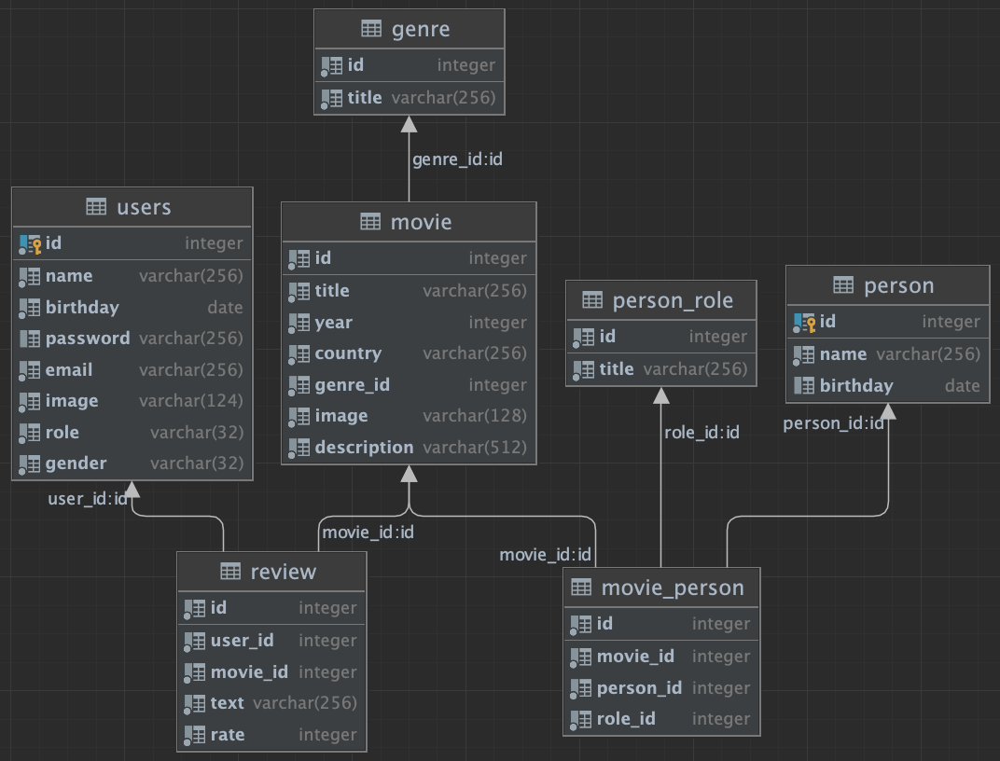

# Video Library

This is a pet project of Lana Timofeeva.
In this project I wanted to show my work with the following technologies:
- Java 14+
- Servlets
- JSP
- JDBC
- Docker
- Postgres
- Migration scripts

## Prerequisites

On you machine you should have:

- Java 14 or higher
- Docker - for application start

##How to get and run application
The following script will clone the project from github repo, 
set permissions to execute start scripts and execute those scripts 
which will start docker containers for postgres and video library itself
and set a network between them.
```
git clone git@github.com:tisv2000/video_library.git
cd video_library
chmod +x start
chmod +x cleanup
./start-app
```

To stop docker containers for Postgres and Video Library and remove network between them, run the cleanup script:
```
./stop-app
```
There are two predefined users:
- Admin: login: admin@gmail.com, password: pass12345
- User: user1@gmail.com, password: pass12345

## Key features
- There are two authorization roles available - User and Admin. Admin has more permissions than a User,
for example only Admin is able to see all reviews for a specific user under `/reviews`
- ???

## Database scheme


## Future improvements

- Use H2 DB for tests, so that real (production) DB is not affected
- More unit tests - for service and util classes
- Localization
- Hide password
- Restrict user to only be able to add one review for the movies + add possibility to delete reviews
- Restrict user to add new movie/movie person (?)
- Add tests with Selenium Web Driver
